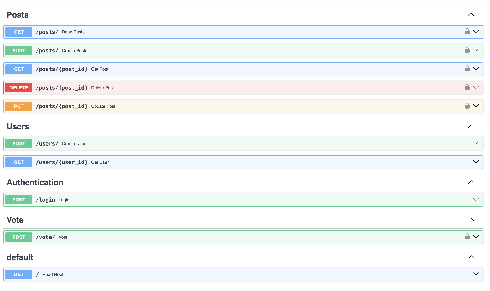

# API_learn

This repository is dedicated to learning and refreshing API basics. It serves as a resource for understanding the fundamentals of working with APIs.

For this mini-project, I have used the fastAPI library to create endpoints. PostgreSQL is used for database creation and storage
of data. I have tried using two methods of accessing the db. First, via SQL statements, for which I have used pydantic library.
I also tried the no-SQL query approach using an ORM (SQLAlchemy) in this case. The code is currently updated to use SQLAlchemy.

Using the free code academy youtube course. Link: `https://www.youtube.com/watch?v=0sOvCWFmrtA`

## Getting Started

To get started with this project, follow these steps:

1. Clone the repository to your local machine
2. Navigate to the project directory
3. It is recommended to use a virtual environment for this project:
    * `python3 -m venv myenv` to install venv if not installed
    * `venv <venv_name>`
    * `source <venv_name>/bin/activate` 
4. Install any necessary dependencies using the `requirements.txt` file provided in your venv
5. You also need to install postgres on your machine
6. Create your own json file with credentials to connect to the DB and change the filepath in `main.py` file
7. Run the project using `uvicorn app.main:app --reload`

## Features

- Comprehensive API documentation.
- Examples and tutorials for different API concepts.
- Code snippets for common API use cases.

## APIs document

Documented APIs so far.

## Contributing

Contributions are welcome! If you have any suggestions, bug reports, or feature requests, please open an issue or submit a pull request.

## License

This project is licensed under the MIT License. See the [LICENSE](LICENSE) file for more information.
